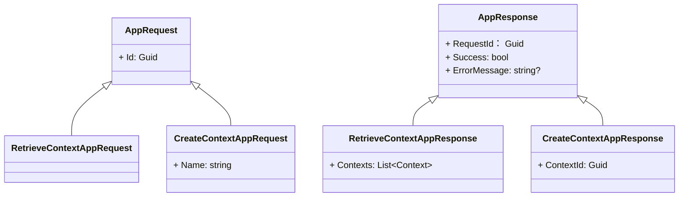

## Generate complete C# code 
File: **2-Application/Activator.DomainDrivenDesigner.Application.Services/ContextAppService.cs**

## Format:
Write a C# **ContextAppService** class

```csharp
public class ContextAppService
{
    ### Your Code Fixed (Allman Style)
}
```

## Rules:
1. Class: **ContextAppService**, Implements: **IContextAppService**

2. Inject below through constructor
- **IDDDRepository**
- **IServiceProvider**

3. Public async method signature: ```Task<RetrieveContextAppResponse> RetrieveContexts(RetrieveContextAppRequest request)```

    Method **RetrieveContexts** logic: 
    ```mermaid
        graph TB
            subgraph main [RetrieveContexts]
                direction TB
                start(("Start"s)) -->
                |request: RetrieveContextAppRequest| loadAllContext["Load All Context -> IDDDRepository.RetrieveContexts()"] -->
                return["`Return **Context**`"]
            end
    ```
4. Public async method signature: ```Task<CreateContextAppResponse> CreateContext(CreateContextAppRequest request)```

    Method **CreateContext** logic: 
    ```mermaid
        graph TB
            subgraph main CreateContext[CreateContext]
                direction TB
                start2(("Start")) --> 
                |request: CreateContextAppRequest| CreateContext["Create a Context -> IDDDRepository.CreateContexts(request.Name)"]-->
                return2["`Return **ContextId**`"]
            end
    ```

## Reference Interface Signatures:
```csharp
Task<List<Domain.Entities.Context>> IDDDRepository.RetrieveContexts();
Task<Guid>> IDDDRepository.CreateContext(string name);
```

## Reference Requests and Responses


## Output
Only output full source code of **ContextAppService.cs** in C# format, no other text. Use async/await correctly and Use ConfigureAwait(false) for each async call.