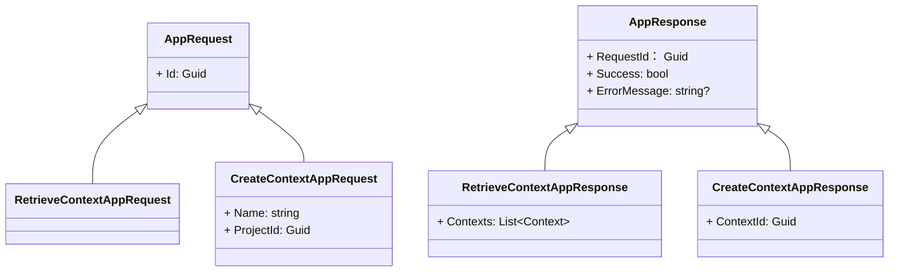

## Generate complete C# code 
File: **2-Application/Activator.DomainDrivenDesigner.Application.Services/ContextAppService.cs**

## Format:
Write a C# **ContextAppService** class

```csharp
public class ContextAppService
{
    ### Your Code Fixed (Allman Style)
}
```

## Rules:
1. Class: **ContextAppService**, Implements: **IContextAppService**

2. Namespace in file-scope: `namespace Activator.DomainDrivenDesigner.Application.Services;`

3. Inject below through constructor
- **IDDDRepository**
- **IServiceProvider**

4. Place Attributes
- Put Attribute [ServiceLocate(typeof(ContextAppService))] to **ContextAppService** class.
- Put Attribute [LogTrace(typeof(*response))] to each method below.

5. Public async method signature: `Task<RetrieveContextAppResponse> RetrieveContexts(RetrieveContextAppRequest request)`

    Method **RetrieveContexts** logic: 
    ```mermaid
        graph TB
            subgraph main [RetrieveContexts]
                direction TB
                start(("Start"s)) -->
                |request: RetrieveContextAppRequest| loadAllContext["Load All Context -> IDDDRepository.RetrieveContexts()"] -->
                return["`Return **Context**`"]
            end
    ```
6. Public async method signature: `Task<CreateContextAppResponse> CreateContext(CreateContextAppRequest request)`

    Method **CreateContext** logic: 
    ```mermaid
        graph TB
            subgraph main CreateContext[CreateContext]
                direction TB
                start2(("Start")) --> 
                |request: CreateContextAppRequest| CreateContext["Create a Context -> IDDDRepository.CreateContexts(request.Name, request.projectId)"]-->
                return2["`Return **ContextId**`"]
            end
    ```
## Ignore Exception Handler since it is included in LogTrace Attribute

## Reference Interface Signatures:
```csharp
Task<List<Domain.Entities.Context>> IDDDRepository.RetrieveContexts();
Task<Guid>> IDDDRepository.CreateContext(string name, Guid projectId);
```

## Reference Requests and Responses:


```csharp
public record CreateContextAppRequest(Guid Id, string Name, Guid ProjectId) : AppRequest(Id);
public record RetrieveContextAppRequest(Guid Id) : AppRequest(Id);
public record CreateContextAppResponse(Guid RequestId, Guid? ContextId, bool Success, string? ErrorMessage) : AppResponse(RequestId, Success, ErrorMessage);
public record RetrieveContextAppResponse(Guid RequestId, List<Context>? Contexts, bool Success, string? ErrorMessage) : AppResponse(RequestId, Success, ErrorMessage);
```

## Output
Only output full source code of **ContextAppService.cs** in C# format, no other text. Use async/await correctly and Use ConfigureAwait(false) for each async call.