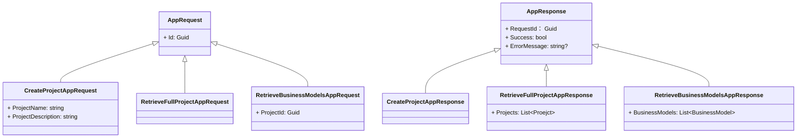

## Generate complete C# code 
File: **2-Application/Activator.DomainDrivenDesigner.Application.Services/ProjectAppService.cs**

## Format:
Write a C# **ProjectAppService** class

```csharp
namespace Activator.DomainDrivenDesigner.Application.Services;

public class ProjectAppService
{
    ### Your Code Fixed (Allman Style)
}
```

## Rules:
1. Class: **ProjectAppService**, Implements: **IProjectAppService**

2. Namespace in file-scope: `namespace Activator.DomainDrivenDesigner.Application.Services;`

3. Inject below through constructor
- **IProjectRepository**
- **IServiceProvider**

4. Place Attributes
- Put Attribute [ServiceLocate(typeof(ProjectAppService))] to **ProjectAppService** class.
- Put Attribute [LogTrace(typeof(*response))] to each method below.

5. Public async method signature: `Task<CreateProjectAppResponse> Create(CreateProjectAppRequest request)`

    Method **Create** logic: 
    ```mermaid
        graph TB
            subgraph main [Create]
                direction TB
                start(("Start"s)) -->
                

                |request: CreateProjectAppRequest| newProject["`Create a new **Project** -> Project.Create(request.ProjectName, request.ProjectDescription`"] -->

                %% {/* ProjectRepository.CreateProject(project).ConfigureAwait(false) */} 
                CreateProject["`Create the **Project** in Db`"] -->

                %% {/* return new CreateProjectAppResponse(request.Id, true, null)  */}
                return["`Return **CreateProjectAppResponse**`"]
            end
    ```

5. Public async method signature: `Task<RetrieveFullProjectAppResponse> RetrieveFullProjects(RetrieveFullProjectAppRequest request)`

    Method **RetrieveFullProjects** logic: 
    ```mermaid
        graph TB
            subgraph main [Create]
                direction TB
                start(("Start"s)) -->

                %% {/* IProjectRepository.RetrieveFullProjects().ConfigureAwait(false) */} 
                |request: RetrieveFullProjectAppRequest| retrieveAllProjects["`Retrieve all **Project**s`"] -->

                %% {/* return new RetrieveFullProjectAppResponse(request.Id, projects, true, null)  */}
                return["`Return **RetrieveFullProjectAppResponse**`"]
            end
    ```

5. Public async method signature: ` Task<RetrieveBusinessModelsAppResponse> RetrieveProjectBusinessModels(RetrieveBusinessModelsAppRequest request)`

    Method **RetrieveProjectBusinessModels** logic: 
    ```mermaid
        graph TB
            subgraph main [Create]
                direction TB
                start(("Start"s)) -->
                
                %% {/* IProjectRepository.RetrieveBusinessModelsByProjectId(request.ProjectId).ConfigureAwait(false) */} 
                |request: RetrieveBusinessModelsAppRequest| retrieveBusniessModelViaProjectId["`Retrieve **BusniessModel** by ProjectId`"] -->

                %% {/* return new RetrieveBusinessModelsAppResponse(request.Id, businessModels, true, null)  */} 
                return["`Return **RetrieveBusinessModelsAppResponse**`"]
            end
    ```

## Ignore Exception Handler since it is included in LogTrace Attribute

## Reference Interface Signatures:

IProjectRepository:

```csharp
Task<Guid?> CreateProject(Project project);
Task<List<Project>> RetrieveFullProjects();
 Task<List<BusinessModel>> RetrieveBusinessModelsByProjectId(Guid ProjectId);
```

## Reference Requests and Responses:


```csharp
public abstract record AppRequest(Guid Id);
public record RetrieveBusinessModelsAppRequest(Guid Id, Guid ProjectId) : AppRequest(Id);
public record CreateProjectAppRequest(Guid Id, string ProjectName, string ProjectDescription) : AppRequest(Id);
public record RetrieveFullProjectAppRequest(Guid Id) : AppRequest(Id);
```
```csharp
public abstract record AppResponse(Guid RequestId, bool Success, string? ErrorMessage);
public record RetrieveBusinessModelsAppResponse(Guid RequestId, List<BusinessModel>? BusinessModels, bool Success, string? ErrorMessage) 
    : AppResponse(RequestId, Success, ErrorMessage);
public record CreateProjectAppResponse(Guid RequestId, bool Success, string? ErrorMessage) 
    : AppResponse(RequestId, Success, ErrorMessage);
public record RetrieveFullProjectAppResponse(Guid RequestId, List<Project>? Projects, bool Success, string? ErrorMessage) 
    : AppResponse(RequestId, Success, ErrorMessage);

```


## Output
Only output full source code of **ProjectAppService.cs** in C# format, no other text. Use async/await correctly and Use ConfigureAwait(false) for each async call.