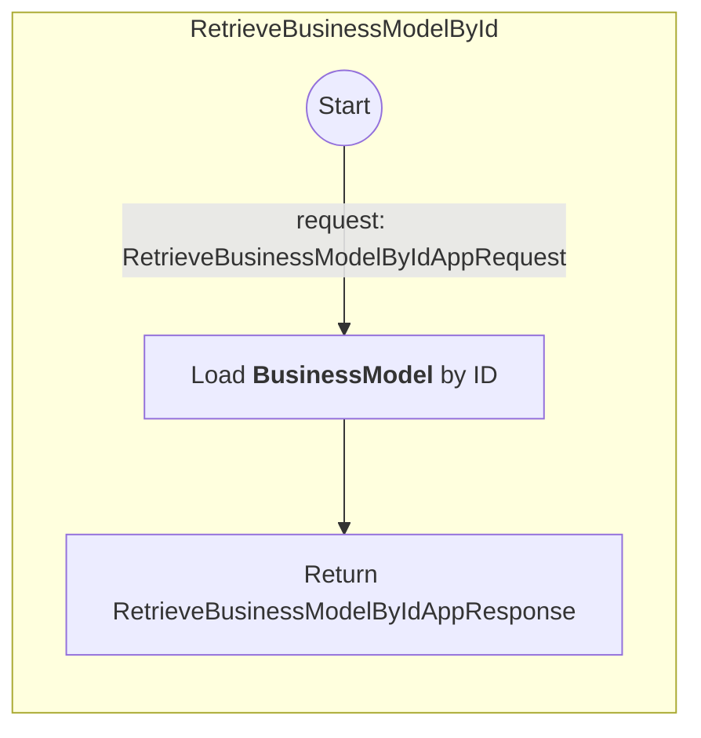
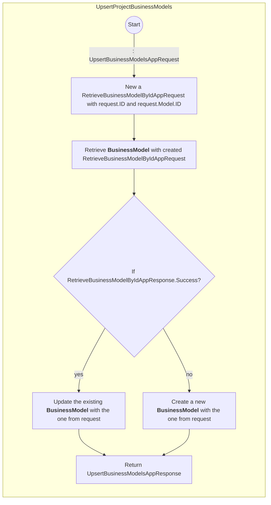
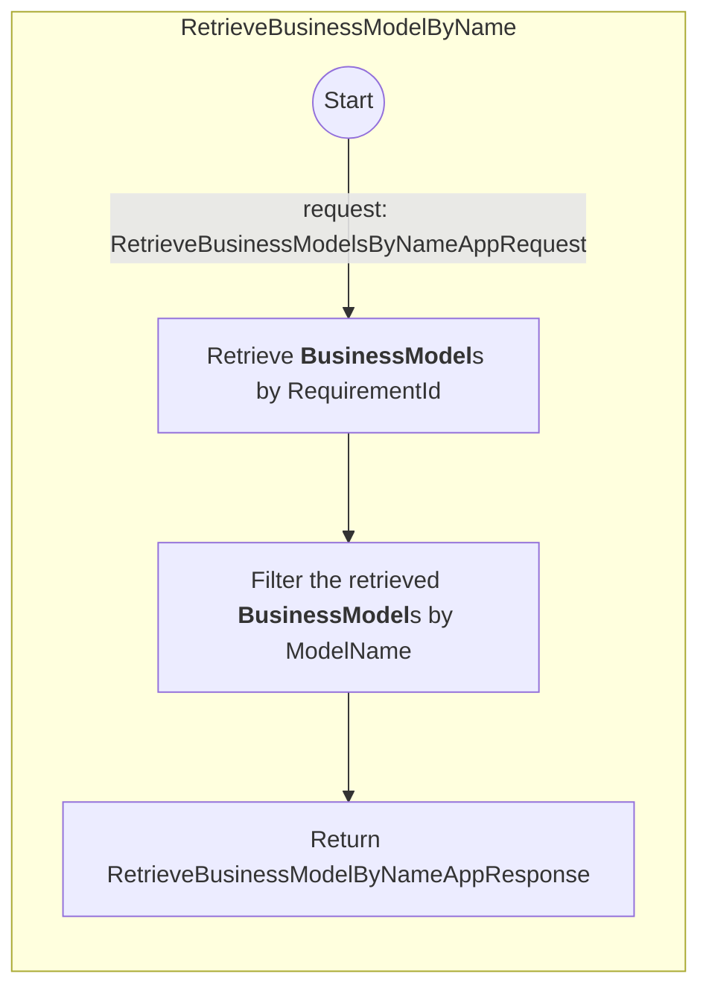
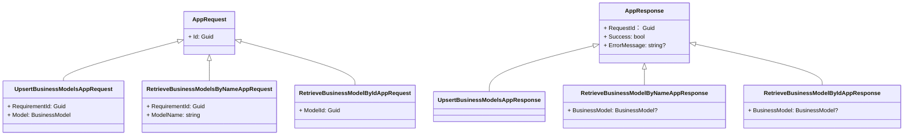

# Activator.DomainDrivenDesigner.Application.Services - BusinessModelAppService

```mermaid method:"RetrieveBusinessModelById"
graph TB
    subgraph RetrieveBusinessModelById
        direction TB
        start(("Start")) --> 
        |request: RetrieveBusinessModelByIdAppRequest| loadBusinessModelById["`Load **BusinessModel** by ID`"] -->
        return["`Return RetrieveBusinessModelByIdAppResponse`"]
    end
```

```mermaid method:"UpsertProjectBusinessModels"
graph TB
    subgraph UpsertProjectBusinessModels
        direction TB
        start(("Start")) -->

        |: UpsertBusinessModelsAppRequest| newRetrieveBusinessModelByIdAppRequest["`New a RetrieveBusinessModelByIdAppRequest with request.ID and request.Model.ID`"] -->
        
        %% Invoke method RetrieveBusinessModelById in this service%%
        RetrieveBusinessModelById["`Retrieve **BusinessModel** with created RetrieveBusinessModelByIdAppRequest`"] -->

        Success{"`If RetrieveBusinessModelByIdAppResponse.Success?`"} -->

        %% Invoke method UpdateBusinessModel in Persistor%%
        |yes| UpdateBusinessModel["`Update the existing **BusinessModel** with the one from request`"] --> 
        
        return["`Return UpsertBusinessModelsAppResponse`"]

        %% Invoke method CreateBusinessModel in Persistor%%
        Success --> |no| CreateBusinessModel["`Create a new **BusinessModel** with the one from request`"] -->

        return
    end
```

```mermaid method:"RetrieveBusinessModelByName"
graph TB
    subgraph RetrieveBusinessModelByName
        direction TB
        start(("Start")) --> 
        |request: RetrieveBusinessModelsByNameAppRequest| RetrieveBusinessModelsByRequirementId["`Retrieve **BusinessModel**s by RequirementId`"] -->
        fiterByName["`Filter the retrieved **BusinessModel**s by ModelName`"] --> 
        return["`Return RetrieveBusinessModelByNameAppResponse`"]
    end
```
---

```mermaid
classDiagram
    class AppRequest {
        + Id: Guid
    }

    class AppResponse {
        + RequestId： Guid
        + Success: bool
        + ErrorMessage: string?
    }

    class UpsertBusinessModelsAppRequest {
        + RequirementId: Guid
        + Model: BusinessModel
    }

    class RetrieveBusinessModelsByNameAppRequest {
        + RequirementId: Guid
        + ModelName: string
    }

    class RetrieveBusinessModelByIdAppRequest {
        + ModelId: Guid
    }

    class UpsertBusinessModelsAppResponse {

    }

    class RetrieveBusinessModelByNameAppResponse {
        + BusinessModel: BusinessModel?
    }

    class RetrieveBusinessModelByIdAppResponse {
        + BusinessModel: BusinessModel?
    }

    

    %% Relationship
    AppRequest <|-- UpsertBusinessModelsAppRequest
    AppRequest <|-- RetrieveBusinessModelsByNameAppRequest
    AppRequest <|-- RetrieveBusinessModelByIdAppRequest

    AppResponse <|-- UpsertBusinessModelsAppResponse
    AppResponse <|-- RetrieveBusinessModelByNameAppResponse
    AppResponse <|-- RetrieveBusinessModelByIdAppResponse

```