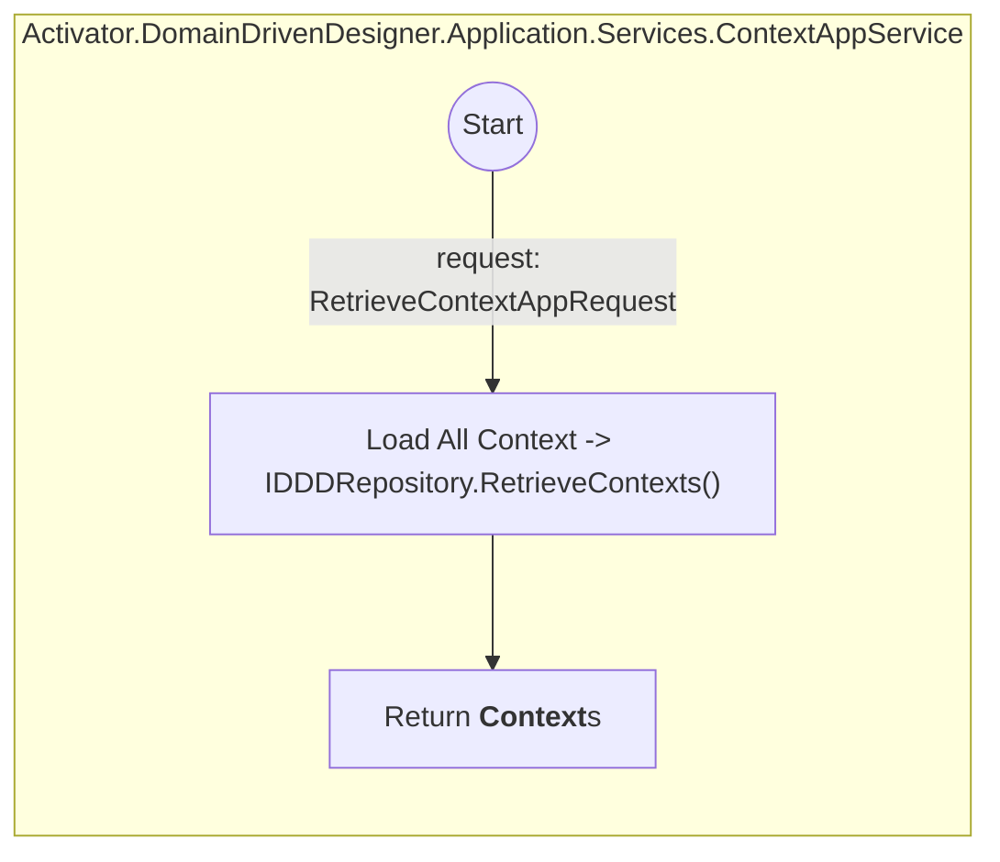
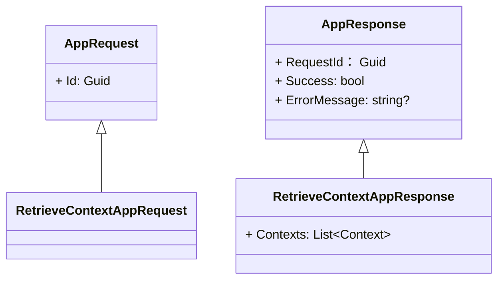

# ContextAppService

```mermaid
graph TB
    subgraph main [Activator.DomainDrivenDesigner.Application.Services.ContextAppService]
        direction TB
        start(("Start")) --> 
        |request: RetrieveContextAppRequest| loadAllContext["Load All Context -> IDDDRepository.RetrieveContexts()"]-->
        return["`Return **Context**s`"]
    end
```

---

```mermaid
classDiagram
    class AppRequest {
        + Id: Guid
    }

    class AppResponse {
        + RequestId： Guid
        + Success: bool
        + ErrorMessage: string?
    }

    class RetrieveContextAppRequest {

    }

    class RetrieveContextAppResponse {
        + Contexts: List~Context~
    }

    %% Relationship
    AppRequest <|-- RetrieveContextAppRequest
    AppResponse <|-- RetrieveContextAppResponse
```