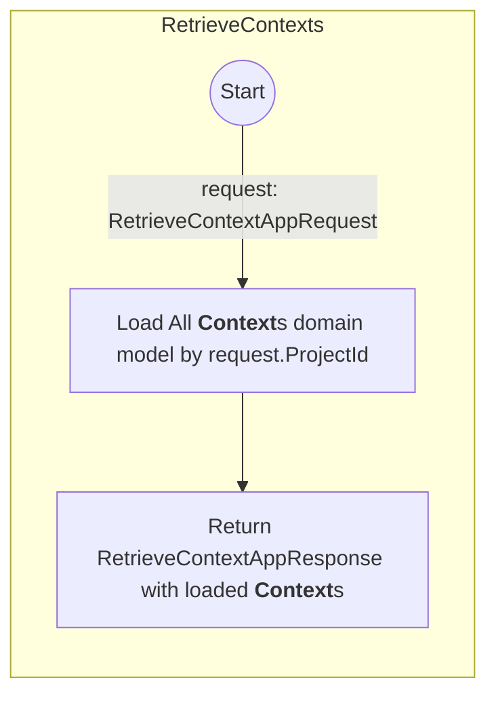
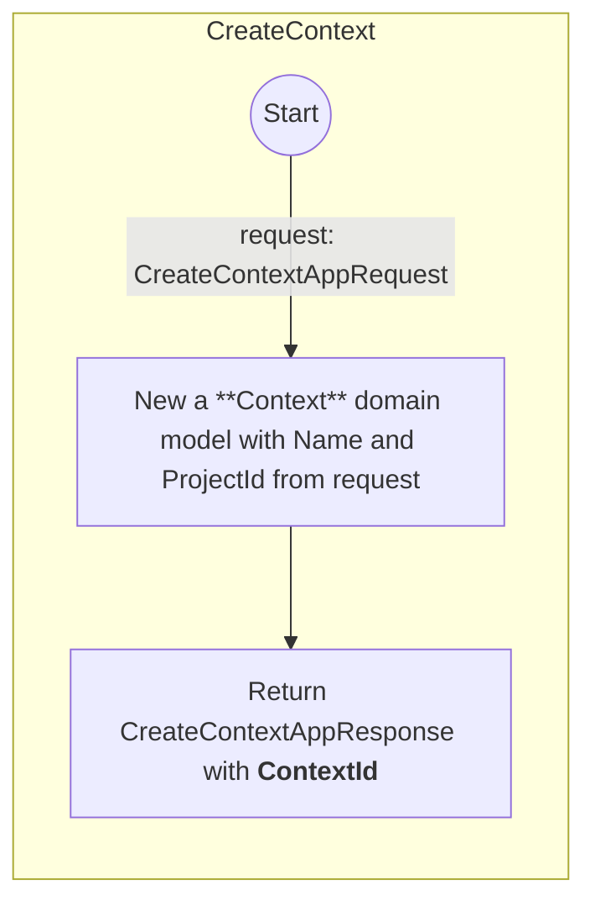
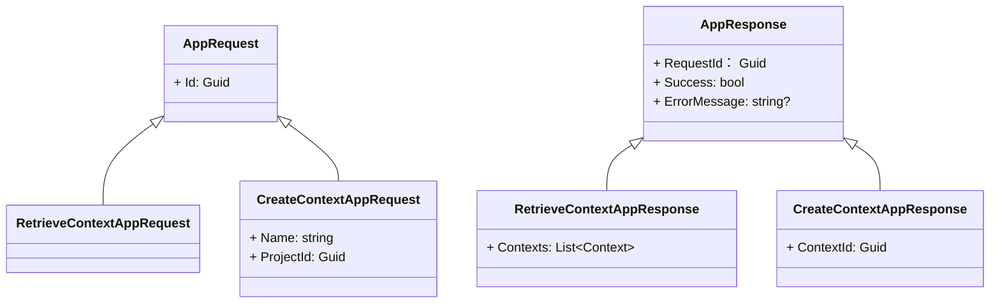

# Activator.DomainDrivenDesigner.Application.Services

```mermaid method:"RetrieveContexts"
graph TB
    subgraph RetrieveContexts
        direction TB
        start(("Start")) -->
        |request: RetrieveContextAppRequest| loadAllContextInProject["`Load All **Context**s domain model by request.ProjectId`"] -->
        return["`Return RetrieveContextAppResponse with loaded **Context**s`"]
    end
```

```mermaid method:"CreateContext"
graph TB
    subgraph CreateContext
        direction TB
        start2(("Start")) --> 
        |request: CreateContextAppRequest| newContext["New a **Context** domain model with Name and ProjectId from request"] -->
        return2["`Return CreateContextAppResponse with **ContextId**`"]
    end
```
---

```mermaid
classDiagram
    class AppRequest {
        + Id: Guid
    }

    class AppResponse {
        + RequestId： Guid
        + Success: bool
        + ErrorMessage: string?
    }
    
    class CreateContextAppRequest {
        + Name: string
        + ProjectId: Guid
    }

    class CreateContextAppResponse {
        + ContextId: Guid
    }

    class RetrieveContextAppRequest {

    }

    class RetrieveContextAppResponse {
        + Contexts: List~Context~
    }

    %% Relationship
    AppRequest <|-- RetrieveContextAppRequest
    AppResponse <|-- RetrieveContextAppResponse

    AppRequest <|-- CreateContextAppRequest
    AppResponse <|-- CreateContextAppResponse

```