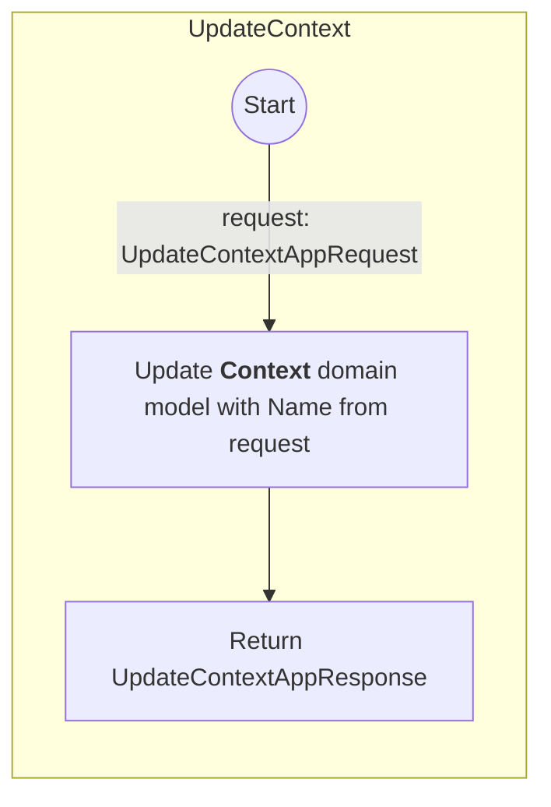
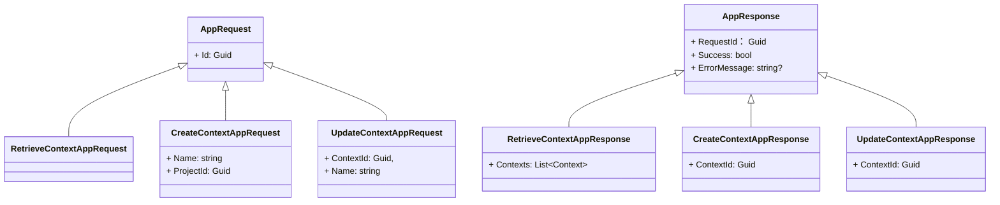

# Activator.DomainDrivenDesigner.Application.Services

```mermaid method:"RetrieveContexts"
graph TB
    subgraph RetrieveContexts
        direction TB
        start(("Start")) -->
        |request: RetrieveContextAppRequest| RetrieveContexts["`Load All **Context**s domain model by request.ProjectId`"] -->
        return["`Return RetrieveContextAppResponse with loaded **Context**s`"]
    end
```

```mermaid method:"CreateContext"
graph TB
    subgraph CreateContext
        direction TB
        start2(("Start")) --> 
        |request: CreateContextAppRequest| CreateContext["`New a **Context** domain model with Name and ProjectId from request`"] -->
        return2["`Return CreateContextAppResponse with **ContextId**`"]
    end
```



---


