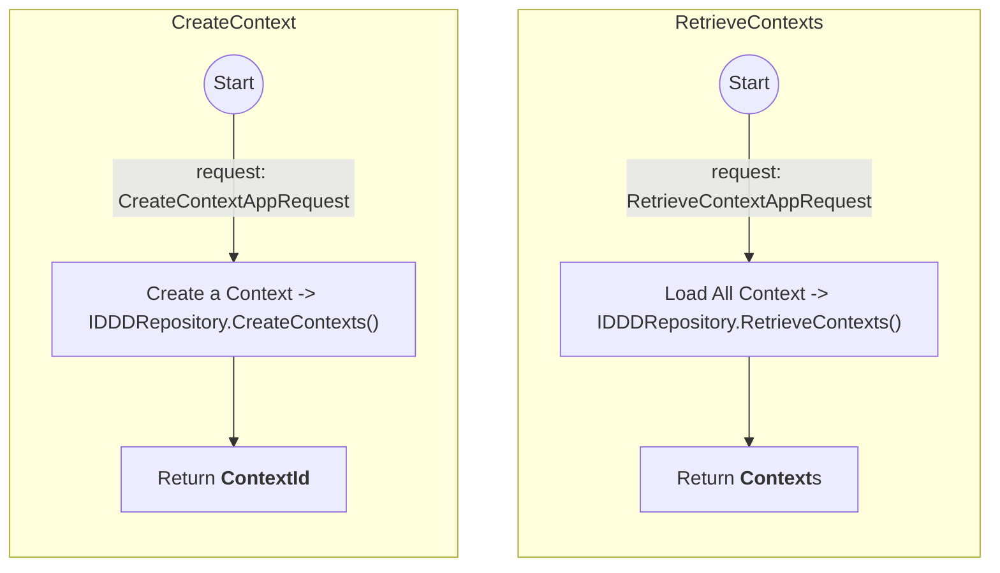
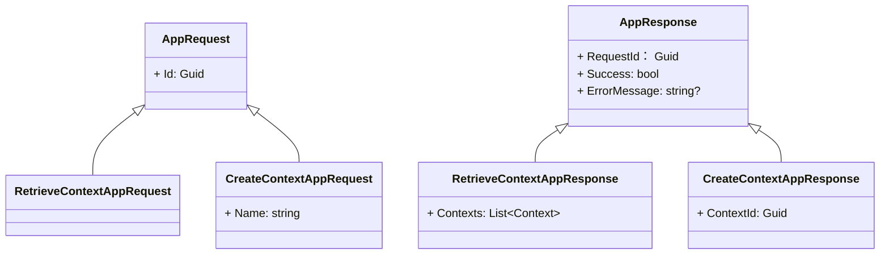

# Activator.DomainDrivenDesigner.Application.Services.ContextAppService

```mermaid
graph TB
    subgraph RetrieveContexts[RetrieveContexts]
        direction TB
        start1(("Start")) --> 
        |request: RetrieveContextAppRequest| loadAllContext["Load All Context -> IDDDRepository.RetrieveContexts()"]-->
        return1["`Return **Context**s`"]
    end

    subgraph main CreateContext[CreateContext]
        direction TB
        start2(("Start")) --> 
        |request: CreateContextAppRequest| CreateContext["Create a Context -> IDDDRepository.CreateContexts()"]-->
        return2["`Return **ContextId**`"]
    end
```
---

```mermaid
classDiagram
    class AppRequest {
        + Id: Guid
    }

    class AppResponse {
        + RequestId： Guid
        + Success: bool
        + ErrorMessage: string?
    }
    
    class CreateContextAppRequest {
        + Name: string
    }

    class CreateContextAppResponse {
        + ContextId: Guid
    }

    class RetrieveContextAppRequest {

    }

    class RetrieveContextAppResponse {
        + Contexts: List~Context~
    }

    %% Relationship
    AppRequest <|-- RetrieveContextAppRequest
    AppResponse <|-- RetrieveContextAppResponse

    AppRequest <|-- CreateContextAppRequest
    AppResponse <|-- CreateContextAppResponse

```