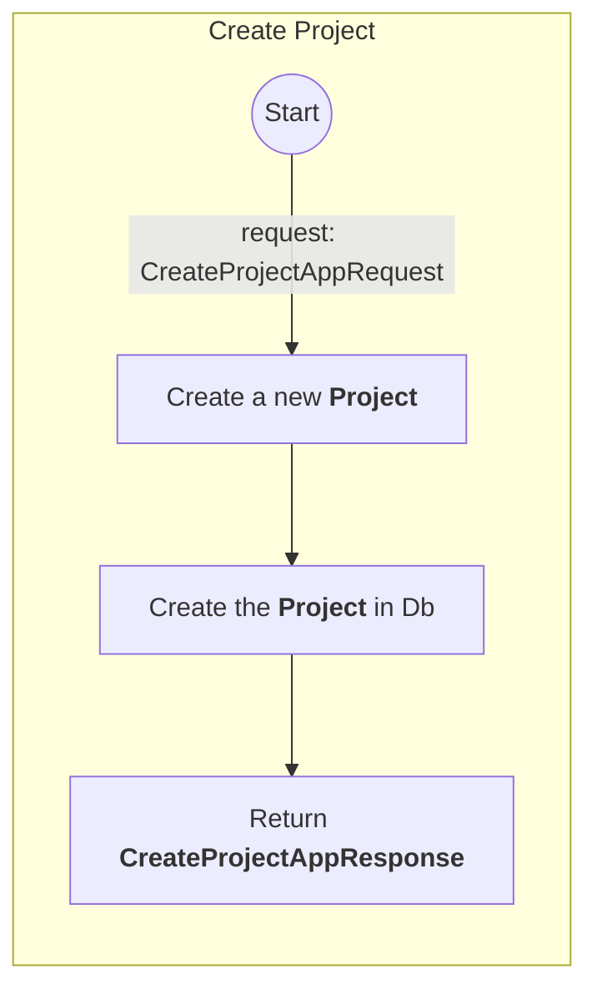
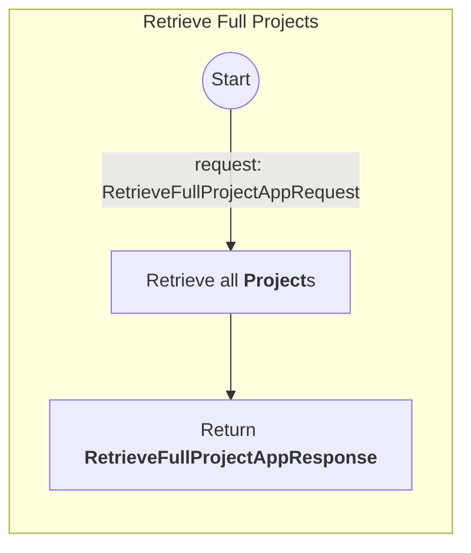
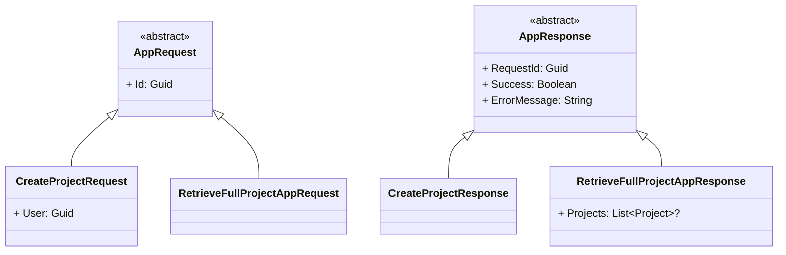

# Application - Project

```mermaid
    graph TB
        subgraph main [Create Project]
            direction TB
            start(("Start")) -->
            |request: CreateProjectAppRequest| newProject["`Create a new **Project**`"] -->
            CreateProject["`Create the **Project** in Db`"] -->
            return["`Return **CreateProjectAppResponse**`"]
        end
```

```mermaid
    graph TB
        subgraph main [Retrieve Full Projects]
            direction TB
            start(("Start")) -->
            |request: RetrieveFullProjectAppRequest| retrieveAllProjects["`Retrieve all **Project**s`"] -->
            return["`Return **RetrieveFullProjectAppResponse**`"]
        end
```
---

```mermaid
    classDiagram
        class AppRequest {
            <<abstract>>
            + Id: Guid
        }

        class AppResponse {
            <<abstract>>
            + RequestId: Guid
            + Success: Boolean
            + ErrorMessage: String
        }

        class CreateProjectRequest {
            + User: Guid
        }

        class CreateProjectResponse {

        }

        class RetrieveFullProjectAppRequest {

        }

        class RetrieveFullProjectAppResponse {
            + Projects: List~Project~?
        }

    %% Relationship
    AppRequest <|-- CreateProjectRequest 
    AppRequest <|-- RetrieveFullProjectAppRequest

    AppResponse <|-- CreateProjectResponse
    AppResponse <|-- RetrieveFullProjectAppResponse

```