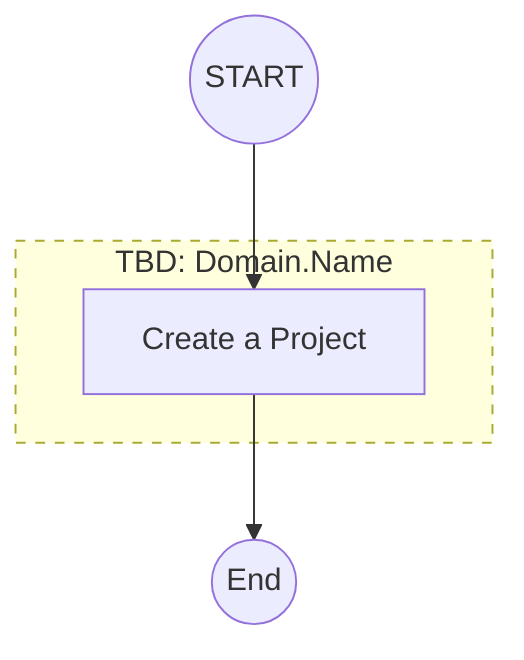
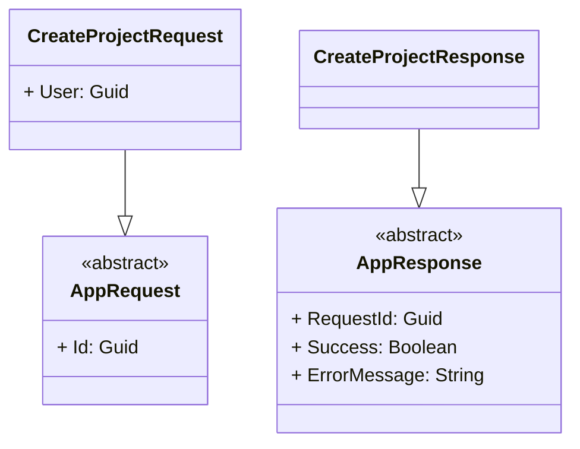

# Application - Project

```mermaid
flowchart TB
    start_process((START))

    subgraph create_project[TBD: Domain.Name]
        Create_Project_Step[ Create a Project]
    end  

    end_process((End))
    
    %% Custom Styles
    style create_project stroke-dasharray: 5 5;

    %% Relationship
    start_process --> Create_Project_Step
    Create_Project_Step --> end_process  

```
---

```mermaid
classDiagram

class AppRequest {
    <<abstract>>
    + Id: Guid
}

class AppResponse {
    <<abstract>>
    + RequestId: Guid
    + Success: Boolean
    + ErrorMessage: String
}

class CreateProjectRequest {
    + User: Guid
}

class CreateProjectResponse {

}


%%Relationship
CreateProjectRequest --|> AppRequest
CreateProjectResponse --|> AppResponse

```