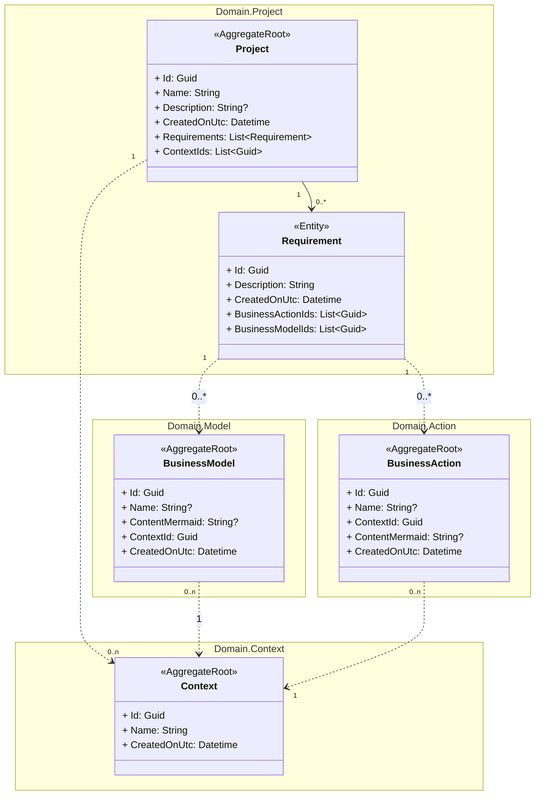

# Domain

```mermaid
classDiagram
namespace nsProject["Domain.Project"] {
    class Project {
        <<AggregateRoot>>
        + Id: Guid
        + Name: String
        + Description: String?
        + CreatedOnUtc: Datetime
        + Requirements: List~Requirement~
        + ContextIds: List~Guid~
    }

    class Requirement {
        <<Entity>>
        + Id: Guid
        + Description: String
        + CreatedOnUtc: Datetime
        + BusinessActionIds: List~Guid~
        + BusinessModelIds: List~Guid~
    }
}

namespace nsBusinessAction["Domain.Action"] {
    class BusinessAction {
        <<AggregateRoot>>
        + Id: Guid
        + Name: String?
        + ContextId: Guid
        + ContentMermaid: String?
        + CreatedOnUtc: Datetime
    }
}

namespace nsBusinessModel["Domain.Model"] {
    class BusinessModel {
        <<AggregateRoot>>
        + Id: Guid
        + Name: String?
        + ContentMermaid: String?
        + ContextId: Guid
        + CreatedOnUtc: Datetime
    }
}

namespace nsContext["Domain.Context"] {
    class Context {
        <<AggregateRoot>>
        + Id: Guid
        + Name: String
        + CreatedOnUtc: Datetime
    }
}

%% Entity Relationship

Project "1" --> "0..*" Requirement
Project "1" ..> "0..n" Context

Requirement "1" ..> BusinessModel : 0..*
Requirement "1" ..> BusinessAction : 0..*

BusinessModel "0..n" ..> Context : 1
BusinessAction "0..n" ..> "1" Context

```