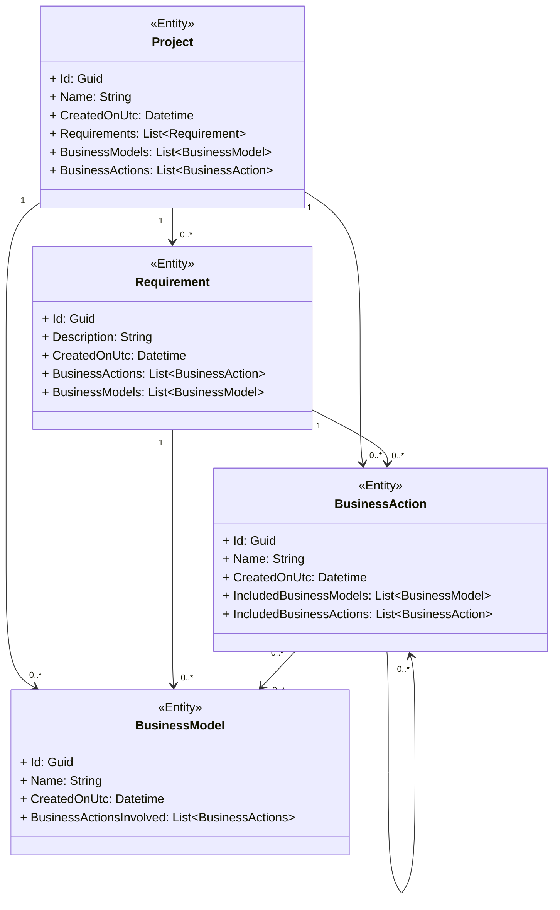

# Domain - Project

```mermaid
classDiagram

class Project {
    <<Entity>>
    + Id: Guid
    + Name: String
    + CreatedOnUtc: Datetime
    + Requirements: List~Requirement~
    + BusinessModels: List~BusinessModel~
    + BusinessActions: List~BusinessAction~
}

class Requirement {
    <<Entity>>
    + Id: Guid
    + Description: String
    + CreatedOnUtc: Datetime
    + BusinessActions: List~BusinessAction~
    + BusinessModels: List~BusinessModel~
}

class BusinessAction{
    <<Entity>>
    + Id: Guid
    + Name: String
    + CreatedOnUtc: Datetime
    + IncludedBusinessModels: List~BusinessModel~
    + IncludedBusinessActions: List~BusinessAction~
}

class BusinessModel{
    <<Entity>>
    + Id: Guid
    + Name: String
    + CreatedOnUtc: Datetime
    + BusinessActionsInvolved: List~BusinessActions~
}


%%Entity Relationship

Project "1" --> "0..*" Requirement
Project "1" --> "0..*" BusinessModel
Project "1" --> "0..*" BusinessAction

Requirement "1" --> "0..*" BusinessModel
Requirement "1" --> "0..*" BusinessAction

BusinessAction "0..*" --> "0..*" BusinessModel
BusinessAction --> "0..*" BusinessAction

```