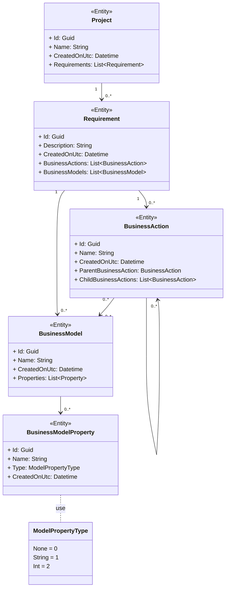

# Domain - Project

```mermaid
classDiagram

class Project {
    <<Entity>>
    + Id: Guid
    + Name: String
    + CreatedOnUtc: Datetime
    + Requirements: List~Requirement~
}

class Requirement {
    <<Entity>>
    + Id: Guid
    + Description: String
    + CreatedOnUtc: Datetime
    + BusinessActions: List~BusinessAction~
    + BusinessModels: List~BusinessModel~
}

class BusinessAction {
    <<Entity>>
    + Id: Guid
    + Name: String
    + CreatedOnUtc: Datetime
    + ParentBusinessAction: BusinessAction
    + ChildBusinessActions: List~BusinessAction~
}

class BusinessModel {
    <<Entity>>
    + Id: Guid
    + Name: String
    + CreatedOnUtc: Datetime
    + Properties: List~Property~
}

class BusinessModelProperty {
    <<Entity>>
    + Id: Guid
    + Name: String
    + Type: ModelPropertyType
    + CreatedOnUtc: Datetime
}

class ModelPropertyType {
    None = 0
    String = 1  
    Int = 2
}

%%Entity Relationship

Project "1" --> "0..*" Requirement

Requirement "1" --> "0..*" BusinessModel
Requirement "1" --> "0..*" BusinessAction

BusinessAction "0..*" --> "0..*" BusinessModel
BusinessAction --> "0..*" BusinessAction

BusinessModel --> "0..*" BusinessModelProperty

BusinessModelProperty .. ModelPropertyType : use

```